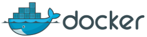
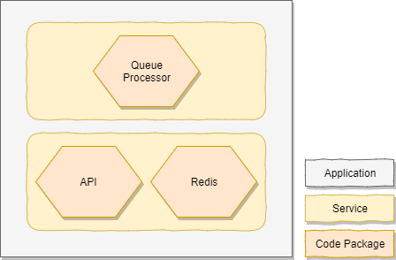

Containo
===========================

Containo is a fictious company that is building a product that provides a catalog of products to buy that 3rd parties can consume.

The company is running their platform on Docker containers written in .NET Core. All of their APIs are being exposed via Kong as an API gateway.

## Service Fabric Mesh
The application is modelled into one Service Fabric Mesh application which containos two services - The API & an asynchronous worker.

Services allow you to define parts of an application that can be scaled independently from other services. In our scenario we would prefer to scale the worker out when messages on the queue pile up while we'd like to scale our API based on CPU and/or memory.

A service can have multiple code packages which are basically Docker containers running next to each other and are scaled together. You should avoid having too many code packages in one service but allow you to use patterns such as the [Sidecar pattern](https://docs.microsoft.com/en-us/azure/architecture/patterns/sidecar).

----------------------------

:rotating_light: This scenario runs a Redis instance in the same service as the API. While this might seem perfect, they have different scaling needs and you might want to use a different appraoch.

----------------------------
