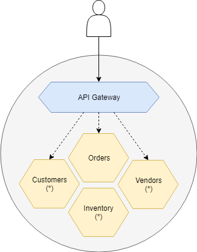

Containo
===========================

Containo is a fictious company that is building a product that provides a catalog of products to buy that 3rd parties can consume.

The company is running their platform on Docker containers written in .NET Core. All of their APIs are being exposed via Kong as an API gateway.

## Business Scenario
Containo is an e-commerce company that is selling products to their customers via a REST API where they can make an order.
Before an order is confirmed, the platform will verify if enough items are available in their inventory and otherwise order more with their vendors.

## Documentation
Here is some documentation on this reference implementation
- [Service Fabric Mesh Composition](./docs/service-fabric-mesh-composition.md)
