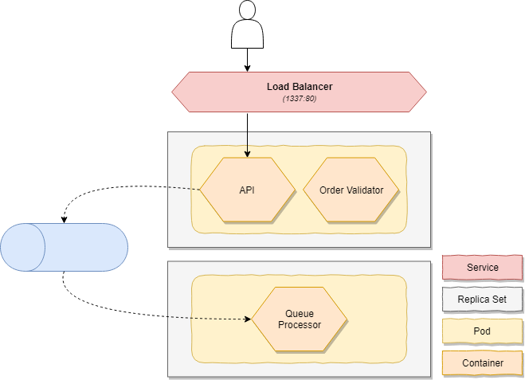

# Kubernetes
The application is modelled in multiple **deployments** which each deploy **replica sets**. Replica sets are a way of defining **pods** that can be scaled, either manually or automatically. In our scenario we will have a replica set for our API & our asynchornous worker.

    **Services** allow you to define parts of an application that can be scaled independently from other services. In our scenario we would prefer to scale the worker out when messages on the queue pile up while we'd like to scale our API based on CPU and/or memory.

    A service can have multiple **code packages** which are basically Docker containers running next to each other and are scaled together. You should avoid having too many code packages in one service but allow you to use patterns such as the [Sidecar pattern](https://docs.microsoft.com/en-us/azure/architecture/patterns/sidecar).

Unfortunately Kuberenetes does not have the concept of "an application" which represents a group of replica sets _(at least not to my knowledge)_. However, it allows you to create isolated **namespaces** which isolate entities from another namespace so that they don't interfer with each other or another person changes your application. Another interesting aspect is that every entity is also capable of providing metadata about itself by assinging **labels**. In our scenario every entity is deployed in a dedicated namespace and has at least the following labels - `app`, `microservice`, `service`, `type`.

By using a **service** we can expose our API to the internet. This entity is using the labels that we have assigned to forward traffic to the internal port of the container inside the pod by using port forwarding.

----------------------------

:rotating_light: _This scenario runs a Redis instance in the same pod as the API. While this might seem perfect, they have different scaling needs and you should not do this but in this scenario I'm using this to indicate how you can run multiple containers in one pod._

----------------------------
