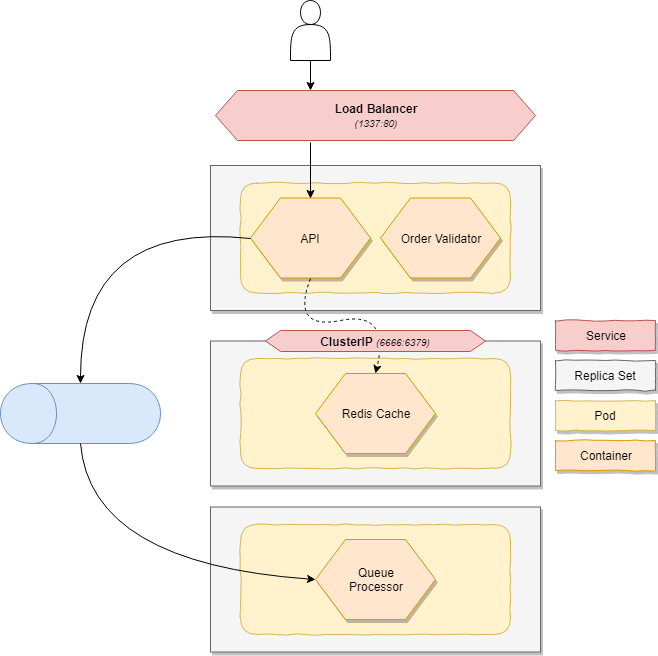

# Kubernetes
The application is modelled in to one **application** which contains two services - The API & an asynchronous worker.

**Services** allow you to define parts of an application that can be scaled independently from other services. In our scenario we would prefer to scale the worker out when messages on the queue pile up while we'd like to scale our API based on CPU and/or memory.

A service can have multiple **code packages** which are basically Docker containers running next to each other and are scaled together. You should avoid having too many code packages in one service but allow you to use patterns such as the [Sidecar pattern](https://docs.microsoft.com/en-us/azure/architecture/patterns/sidecar).

The API service is part of a **network** which is exposing the API to the internet. To achive this, the service defines an endpoint with its internal port which is referenced in the network configuration and assigns a public port to leverage port forwarding.

----------------------------

:rotating_light: _This scenario runs a Redis instance in the same pod as the API. While this might seem perfect, they have different scaling needs and you should not do this but in this scenario I'm using this to indicate how you can run multiple containers in one pod._

----------------------------
